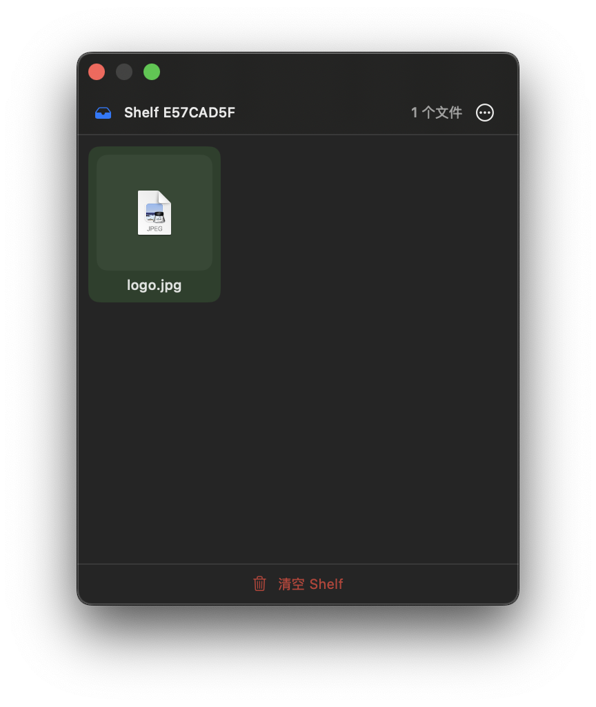
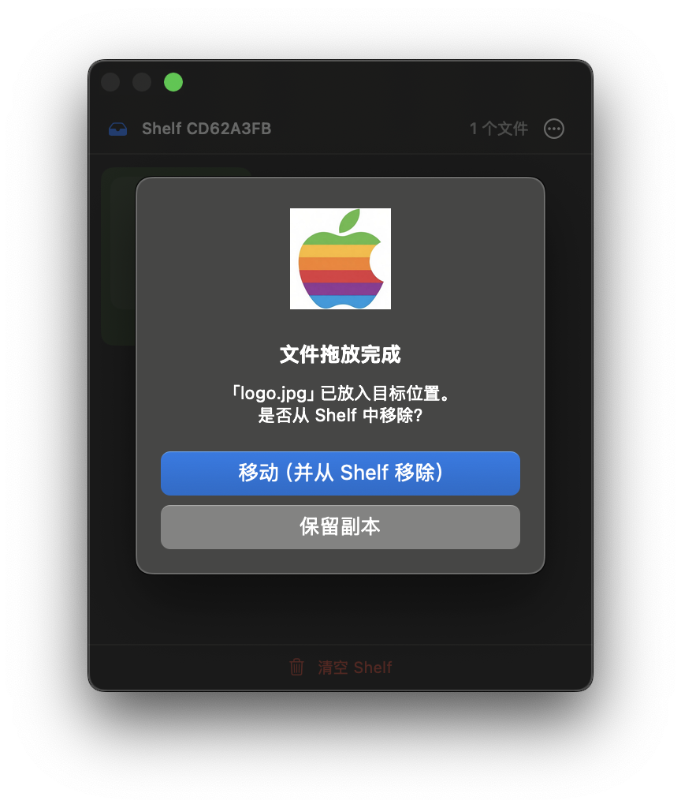

# DropOverMini

macOS menu bar app for temporary file staging and drag-and-drop. Open-source alternative to [Dropover](https://dropoverapp.com/).


[](https://github.com/taozhiyuai/dropover-mini/releases/latest)

## Screenshots




## Features

- 📦 **Menu bar app** — click to create a Shelf, drag files in to stage
- ⌨️ **Global hotkey** — `⌘⇧N` to quickly create a new Shelf
- 🖱️ **Drag in** — drop files/folders into the Shelf window
- 🚀 **Drag out** — drag files from Shelf to Finder or any destination
- ✅ **Multi-select** — click to toggle selection (green highlight), `⌘+A` to select all
- 🗑️ **Clear** — one button to clear the current Shelf
- 🔄 **Move or copy** — after drag-out, choose "Move" (removes from Shelf) or "Keep copy"
- ⚡ **Auto-launch ready** — creates a Shelf automatically on startup
- 🌐 **Multi-language** — English & 简体中文 (auto-detects system language)

## Quick Start

### Download

Download the latest release, unzip and double-click `DropOverMini.app`:
https://github.com/taozhiyuai/dropover-mini/releases/latest

### Build from source

```bash
git clone https://github.com/taozhiyuai/dropover-mini.git
cd dropover-mini
./build.sh
open build/DropOverMini.app
```

On first launch, grant Accessibility permission if you want the `⌘⇧N` hotkey:
**System Settings → Privacy & Security → Accessibility**

## Usage

| Action | Result |
|--------|--------|
| Drag file to Shelf | Stage file |
| Drag file out of Shelf | Copy/move to destination |
| Click file icon | Toggle selection (green highlight) |
| `⌘+A` | Select all files in current Shelf |
| Right-click file | Open / Show in Finder / Quick Look |
| Bottom button | Clear current Shelf |

## Tech Stack

- SwiftUI + AppKit hybrid
- Native drag-and-drop (NSDraggingSession)
- Global hotkey via CGEvent tap
- Localization via `.strings` files
- Requires macOS 14+

## Project Structure

```
DropOverMini/
├── Sources/DropOverMini/
│   ├── App.swift                  # App entry & menu bar
│   ├── Localizable.swift          # i18n string helper
│   ├── ShelfManager.swift         # Shelf lifecycle management
│   ├── ShelfWindowController.swift
│   ├── Models/Shelf.swift
│   ├── Views/
│   │   ├── ShelfPanelView.swift  # Main panel (drag in/out)
│   │   └── SettingsView.swift
│   └── Services/
│       ├── HotKeyManager.swift
│       └── QuickLookService.swift
├── en.lproj/                     # English strings
├── zh-Hans.lproj/                # Chinese (Simplified) strings
├── AppIcon.icns
└── Package.swift
```

## Adding a New Language

Create a new `xx.lproj/` directory under `Sources/DropOverMini/`, copy `Localizable.strings` from `en.lproj/`, and translate all values. The app auto-detects system language on launch.
